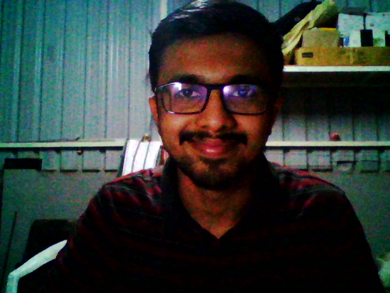
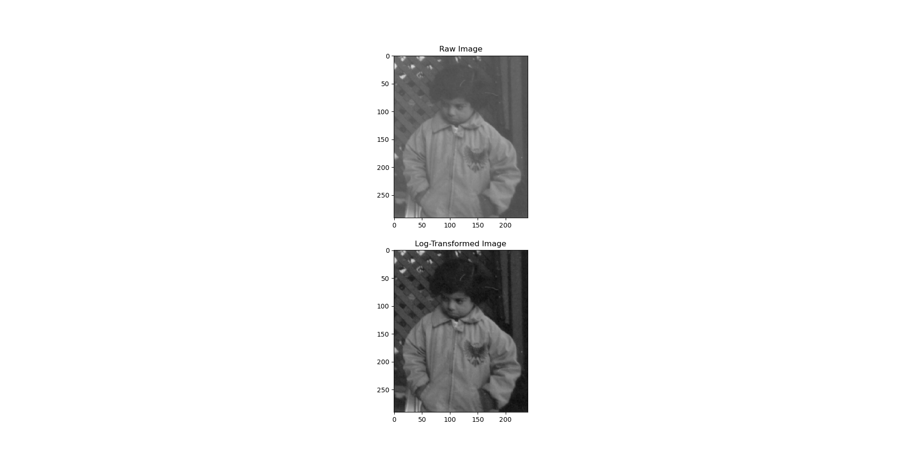
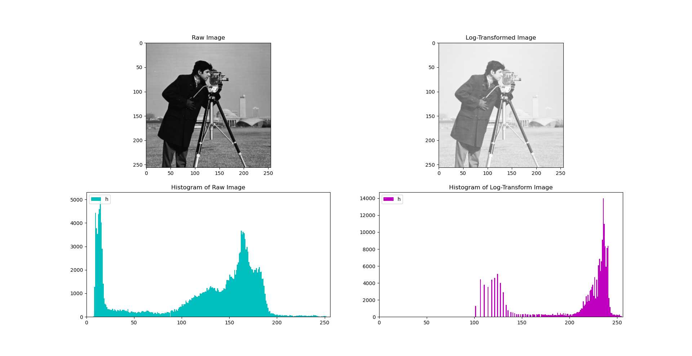
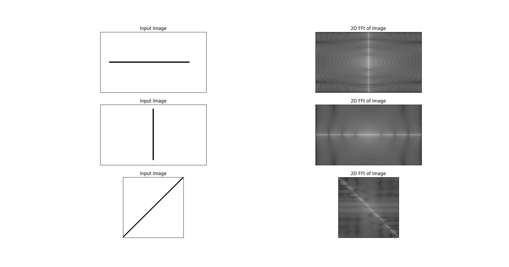
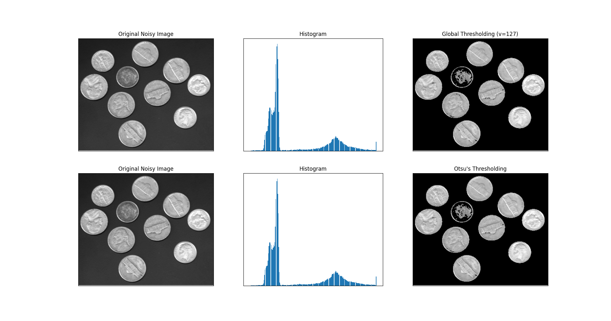
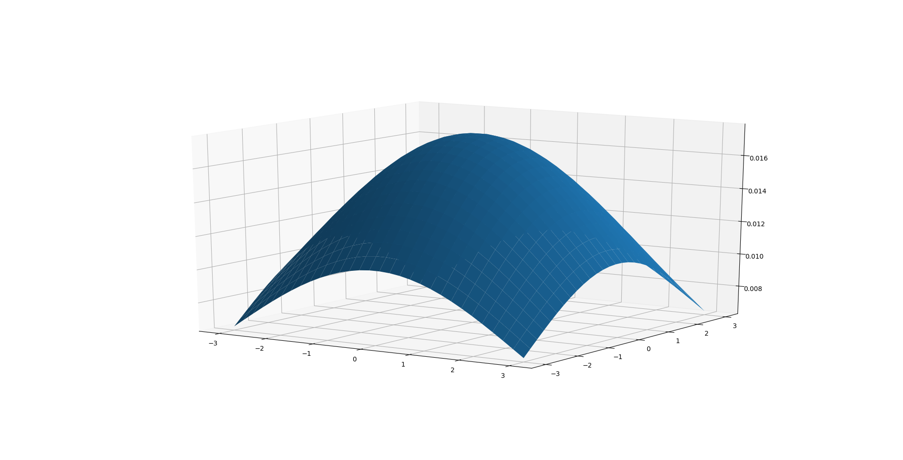
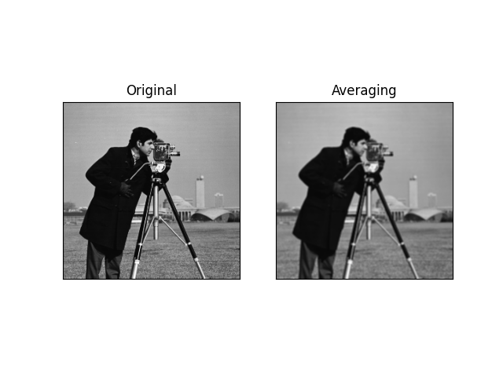
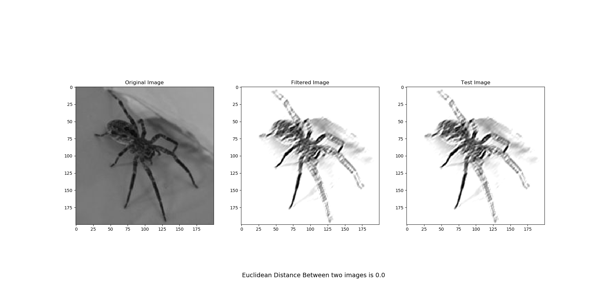
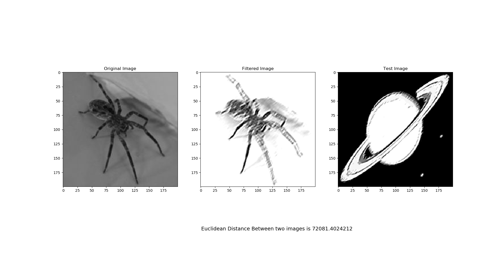

# Vision Based Automation Lab
## 
### All Labs listed below are completed in my academic-course related to **Image Processing**.

| Name of File  | Description of Lab | Output/Result     |
|--------|----------|--------|
| Lab1.py| Capture Image and Video   from webcam of laptop.||
|Lab2.py | Log Transformation of Image.||
|Lab3(Tut).py| Plotting Histogram of Raw Image  and Log-Transformed Image.||
|Lab4.py| Implementation of Sobel Operators  and FFT.| *In Progress*........|
|FFT.py| Implementation of Fast Fourier  Transform on Images.||
|Segmentation.py| Otsu's and Global Thresholding  implemented.||
|3DgaussianFilter.py| 3D visualization of Gaussian Curve.||
|lpf.py| Low Pass Filtering(Averaging) of  an Image.| |
|Gabor_kernel.py | Calculating 7X7 Gabor Kernel(Matrix)  with θ = 0°, 45° and 90°.|"Results/gaborcoeff.txt"|
|gaborusingcv2.py| Implemented Gabor Filter on Image  and Calculated Euclidean Norm between  Filtered and Test Image.|  |

 

Any suggestions or queries, contact me on rohit.asegaonkar18@vit.edu
###### USE THIS REPO FOR EDUCATIONAL OR ANY PURPOSE AND STAR THE REPO AFTER USING IT.