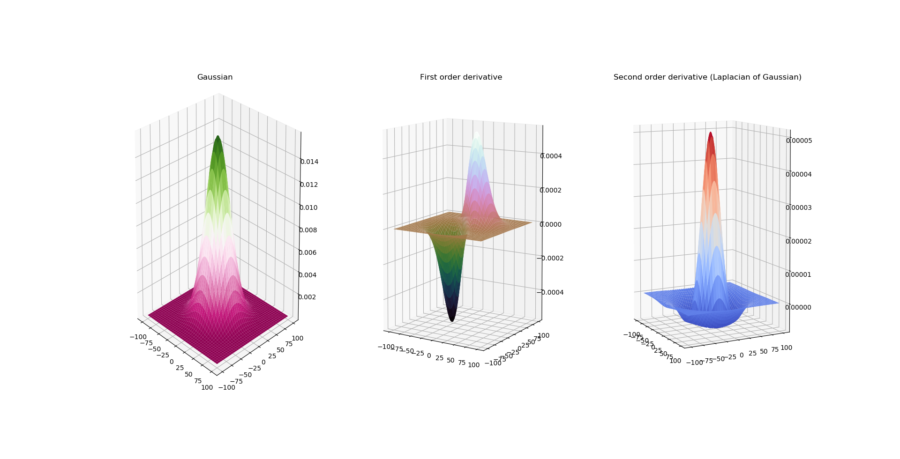

# Vision Based Automation Lab
## 
### All Labs listed below are completed in my academic-course 2020 -21 related to **Image Processing**.

Clone the Repo using following command in Terminal:
```.py
git clone https://gitlab.com/ARohitt/vision-based-automation-lab.git
```

|Sr. No.| Name of File  | Description of Lab | Output/Result     |
|-------|--------|----------|------------|
| 1.|Lab1.py| Capture Image and Video <br /> from webcam of laptop.||
|2.|Lab2.py | Log Transformation of Image.||
|3.|Lab3(Tut).py| Plotting Histogram of Raw Image<br/> and Log-Transformed Image.||
|4.|Lab4.py| Implementation of Sobel Operators <br/>and FFT.| *In Progress*........|
|5.|FFT.py| Implementation of Fast Fourier <br/>Transform on Images.||
|6.|Segmentation.py| Otsu's and Global Thresholding<br> implemented.||
|7.|3DgaussianFilter.py| 3D visualization of Gaussian Curve.||
|8.|lpf.py| Low Pass Filtering(Averaging) of<br> an Image.| |
|9.|Gabor_kernel.py | Calculating 7X7 Gabor Kernel(Matrix)<br> with θ = 0°, 45° and 90°.|[Gabor Kernel File](https://gitlab.com/ARohitt/vision-based-automation-lab/-/blob/master/Results/gaborcoeff.txt)|
|10.|gaborusingcv2.py| Implemented Gabor Filter on Image<br> and Calculated Euclidean Norm between<br> Filtered and Test Image.| <br>|
|11.|3DGabor_Transform.py|3D Visualization of Gabor Transform(Gaussian, First Derivative and Laplacian).||

<br>


Any suggestions or queries, contact me on [ARohitt](mailto:rohit.asegaonkar18@vit.edu).<br>
<a href="https://www.instagram.com/rohitasegaonkar/?hl=de">
     
</a>
<a href="https://www.facebook.com/hatch.damp">
     
</a>
<a href="https://www.linkedin.com/in/rohit-asegaonkar-b8657216a/">
     
</a>
<a href="https://github.com/RohitAsegaonkar">
     
</a>
<a href="https://gitlab.com/ARohitt">
     
</a>


###### USE THIS REPO FOR EDUCATIONAL OR ANY PURPOSE AND SHARE THE REPO AFTER USING IT.